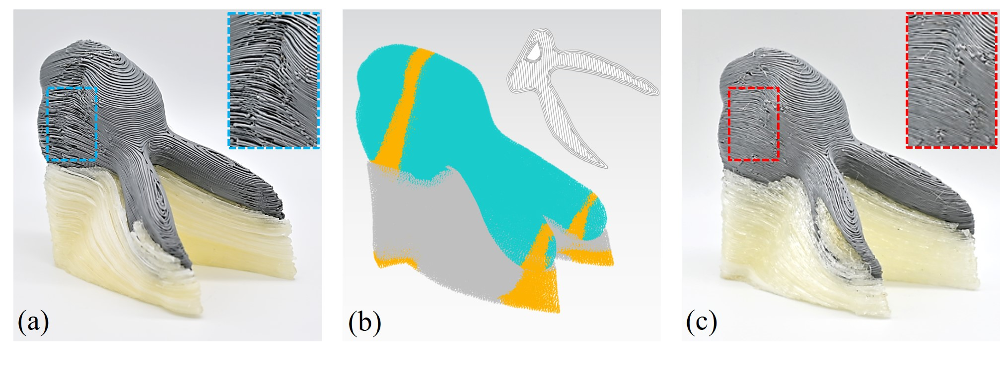

# Singularity-Aware Motion Planning for Multi-AxisAdditive Manufacturing (RAL2021 & CASE2021)

Tianyu Zhang,  Xiangjia Chen, [Guoxin Fang](https://guoxinfang.github.io/), Yingjun Tian, [Charlie C.L. Wang](https://mewangcl.github.io/), [*IEEE Robotics and Automation Letters*, vol. 6, no. 4, pp. 6172-6179, Oct. 2021, doi: 10.1109/LRA.2021.3091109.](https://ieeexplore.ieee.org/document/9462416)

This code can translate the position and orientation information in the Model Coordinate System (MSC) into a Cartesian-based Machine Coordinate System (MSC) and generate G-code, which brings a smooth and collision-free motion for multi-axis 3D printing. [Video Link](https://www.youtube.com/watch?v=fsE2KpLk7ZI&t=7s)

## Installation

Please compile the code with QMake file "ShapeLab.pro".

**Platform**: Windows + Visual Studio + QT-plugin (tested QT version: 5.12.3 + msvc2017_64)

**Install Steps**: 
- **Install Visual Studio Extension plug-in (QT VS Tool)** to open the .pro file and generate the project
- **Set 'shapeLab' as the start up project**
- **Enable OpenMP to get best performace** at: ShapeLab Project Property -> 'Configuration Proerties' -> c/c++ -> Language -> Open MP Support -> Select 'Yes (/openmp)'
- **Open Console** at: ShapeLab Project Property -> 'Configuration Proerties' -> Linker -> System -> Select 'Console (/SUBSYSTEM:CONSOLE)' in 'SubSystem'

## Usage

**Step 0: input waypoints and curved mesh into the system.**
Click button '**Read Data**'.

- The waypoint and layer data of several models are given as 'freeform', 'simple_curve', 'topology', 'yoga' and so on. You can type in the model names into the block '**File Dir**', and more model names could be found in '**./MultiAxis_3DP_MotionPlanning/DataSet/Sorce/**'

- You can also change the model's position on the Print Platform by changing the value in 'Coordinate: **X**, **Y**, **Z**' 

- Lable '**Waypoint Layer Range**' will show the number of models, and you can check layers and waypoints with each layer or between certain ranges by changing the value of spinbox '**to**' and checkbox '**each**'

- Button '**Show ALL Layer**' can be used to show all of the layers of the model.

- **Note**: When the model is 'topology' and 'yoga', the checkbox '**Yup -> Zup**' needs to be checked.

- In the '**Key parameter**' part, '**Opt Computation**' defines which set of layers will be calculated, and '**Offset**' means the difference between extruders(model material & support material), '**Lamda**' is the thresholde of singular region detection.

**Step 1: calculate extrusion volume of each waypoint**
Click button '**1. Variable Filament Calculation**'.

- The volume of filament is dynamically changing according to the waypoints distance (D), layer height (H) or toolpath width (W) by checking the corresponding box.

**Step 2: conduct singularity optimization** 
Click button '**2. Singularity Optimization**'.

- After finishing this step, you can draw the singular node by select the box 'Singular Node'

- The checkbox 'Solve Selection' can be used for showing which inverse kinematics solve is selected after optimization. Red nodes mean solve 1, and blue nodes mean solve 2.

**Step 3: detect collision between printing head, platform and model** 
Clicking button '**3. Collision Checking**'

- Red nodes shown in this step represent when the nozzle moves to this position, the collision will occur. And the nozzle will collide with black nodes.

- **Note**: This process may take some time to check the collision.

**Step 4: conduct graph search**
Clicking button '**4. Collision Elimination**'

- Build a graph based on all of the accessible solves of each waypoint and find the shortest path to link each waypoint

- **Note**: Button 'Continuous Collision Checking' is an additional function for improving the sample-based collision checking method.

**Step 5: generate G-code file** 
Clicking button '**5. G Code Writing**'. 

- The G code will be stored at folder '**./MultiAxis_3DP_MotionPlanning/DataSet/Gcode**'

**Step 6: simulate the motion of printing** 
Clicking button '**Simulation**'.

- The **progress bar** shows the percentage of completed print volume, and clicking the checkbox '**stop**' will stop the simulation from running.

## Curved Layer Generation Algorithm

- The inputed layers and waypoints are generated from this paper ([*ACM Transactions on Graphics (Proceedings of SIGGRAPH Asia 2020)*, vol.39, no.6, article no.204, 2020.](https://dl.acm.org/doi/abs/10.1145/3414685.3417834)) , In specifically, this repository is supporting the part "Fabrication Enabling" of above TOG paper.([Source Code](https://github.com/GuoxinFang/ReinforcedFDM)),([Project Page](https://guoxinfang.github.io/ReinforcedFDM.html)),( [Video Link](https://www.youtube.com/watch?v=X2o2-SJFv2M)).

## Contact Information
Tianyu Zhang (tianyu.zhang-10@postgrad.manchester.ac.uk)

Guoxin Fang  (g.fang-1@tudelft.nl)

Charlie C.L. Wang  (changling.wang@manchester.ac.uk)
